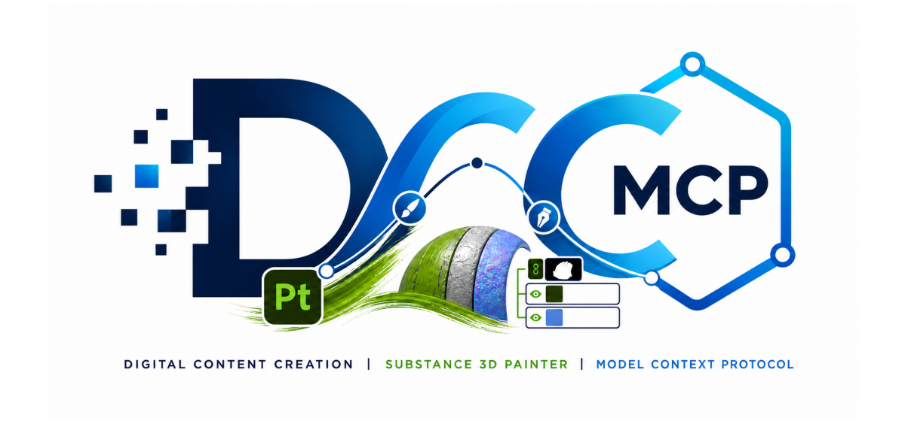

# dcc-mcp-substance3d-painter

<p align="center">
  
</p>

## Agent workflow

AI agents should use the shared gateway through `dcc-mcp-cli`; IDE users may
continue to use the MCP endpoint. Prefer typed skills and tools over raw scripts.

### Install or update the CLI

`dcc-mcp-cli` is the preferred control path for every shell-capable agent. If
it is missing, ask the user before installing the latest official release:

```bash
# Linux/macOS
curl -fsSL https://raw.githubusercontent.com/dcc-mcp/dcc-mcp-core/main/scripts/install-cli.sh | sh

# Windows PowerShell
powershell -ExecutionPolicy Bypass -c "irm https://raw.githubusercontent.com/dcc-mcp/dcc-mcp-core/main/scripts/install-cli.ps1 | iex"
```

Keep an official build current through the release manifest:

```bash
dcc-mcp-cli update check
dcc-mcp-cli update apply
```

`update apply` downloads and stages the latest CLI for the next launch. It
does not update a running `dcc-mcp-server`; update that server in its own
environment.

```bash
dcc-mcp-cli dcc-types
dcc-mcp-cli list
dcc-mcp-cli search --query "<task>" --dcc-type substance3d_painter
dcc-mcp-cli describe <tool-slug>
dcc-mcp-cli call <tool-slug> --json '{"key":"value"}'
```

`dcc-types` reports release-catalog support; `list` reports live sessions. If a
tool belongs to an inactive progressive skill, call `dcc-mcp-cli load-skill <skill-name> --dcc-type substance3d_painter` before retrying. For post-task improvement,
attach a stable session id with `--meta-json`, query `dcc-mcp-cli stats --range 24h --session-id <task-id>`, then pass the bounded evidence to the
`review_skill_improvement` prompt from `dcc-mcp-skills-creator`.


Substance 3D Painter adapter for the DCC Model Context Protocol (MCP).

It embeds a Streamable HTTP MCP server in Painter and routes host API calls
through Painter's Qt main thread. Painter uses an OS-assigned port by default
and advertises the endpoint through DCC-MCP discovery.

## Install and load

Install into the Python environment Painter uses:

```bash
python -m pip install dcc-mcp-substance3d-painter
```

Point `SUBSTANCE_PAINTER_PLUGINS_PATH` at the installed package's
`dcc_mcp_substance3d_painter/painter` folder and add the installation root to
`PYTHONPATH`. Painter discovers the packaged
`startup/dcc_mcp_substance3d_painter_plugin.py` entry point and starts the
adapter automatically.

Set `DCC_MCP_SUBSTANCE3D_PAINTER_PORT` before launching Painter only when a
fixed port is required; `0` keeps automatic allocation. Standard
`DCC_MCP_GATEWAY_PORT` and `DCC_MCP_REGISTRY_DIR` settings are also honoured.

## Bundled skills

`painter-project` provides typed tools for a complete material-authoring pass:

- inspect the project and texture sets;
- create PBR fill layers;
- search Painter resources and apply smart materials;
- list export presets, save the `.spp`, and export textures.

The tools use Painter resource and preset URLs supplied by Painter itself. They
do not expose raw JavaScript or arbitrary script execution.

## Development

```bash
python -m pip install -e ".[dev]"
python -m pytest
ruff check src tests tools
python -m build
```

Releases use release-please. The `release.yml` workflow publishes through the
`pypi` environment using PyPI Trusted Publishing.
